<picture>
  <source media="(prefers-color-scheme: dark)" srcset="https://capsule-render.vercel.app/api?type=waving&height=150&color=0:0d1117%2C1:1f6feb&section=header&text=Huan&fontSize=44&fontColor=ffffff&desc=Agent%20Engineering%20%C2%B7%20AIOps%20Research&descSize=17&descAlignY=70&animation=fadeIn" />
  
</picture>

  <picture>
    <source media="(prefers-color-scheme: dark)" srcset="https://readme-typing-svg.demolab.com?font=Fira+Code&weight=500&size=19&pause=1200&color=58A6FF&center=true&vCenter=true&width=580&lines=LLM+Agent+Engineering+%C2%B7+AIOps+Research;Merged%3A+CrewAI+%C2%B7+LangChain+%C2%B7+RAGFlow+%C2%B7+DSPy;Production-minded+agents%2C+real+systems" />
    
  </picture>

### 🧭 About Me

Hi, I'm **Huan** 👋 — I'm from Henan, China.

I'm a first-year master's student in Electronic Information at Beijing University of Posts and Telecommunications (BUPT).

I'm currently working on LLM agent engineering, optical network AIOps, and MR digital twins.

  

| Domain | Tools (by usage frequency) |
|:--|:--|
| **Agent Engineering** |    |
| **Optical Networks & XR** |    |
| **Frontend & Toolchain** |     |

### 🔬 Research · AIOps for Optical Networks

Building a closed loop of **full-optical sensing → intelligent diagnosis → decision simulation → automatic self-healing** for **AIOps for Optical Networks**:

- [**OptiWise**](https://github.com/HUAN2022A/OptiWise) — Interactive concept demo of optical-network AIOps: four scenarios (provincial backbone / metro OTN / ultra-long-haul / computing DCI), covering intelligent monitoring (OSNR · OPM spectra · degraded channels), fault drills (alarm compression → root-cause localization → one-click detour-based self-healing), 30-day health prediction, and an AI ops assistant.
- [**OpticalNetTwin**](https://github.com/HUAN2022A/OpticalNetTwin) — Quest 3 MR digital-twin sandbox for optical networks: Unity 6 + Meta XR passthrough, 50-node / 54-link holographic topology, and a six-act closed loop of "fault burst → impact localization → protection switching → recovery review".
- [**Quest3-MR-Assistant**](https://github.com/HUAN2022A/Quest3-MR-Assistant) — Quest 3 MR visual ops assistant: passthrough camera + VLM to understand on-site equipment in real time, backed by a PC-side LLM service for ops Q&A.

### 📑 Engineering · Bid Document Intelligence

An end-to-end workflow for **bid documents**: tender parsing → point-by-point response → machine checking → final export:

- [**bid-skills**](https://github.com/HUAN2022A/bid-skills) — A skill family for technical proposal writing: tender document in, compliant technical proposal .docx out; a scoring-point ledger runs through parsing → outlining → rewriting → checking → export, so no scoring point is ever silently missed.
- [**Bid-AgentMate**](https://github.com/HUAN2022A/Bid-AgentMate) — Intelligent proposal-writing platform: productizing bid-skills into an independent FastAPI + React application (in development).
- [**bid-analyzer**](https://github.com/HUAN2022A/bid-analyzer) — Standalone tender-analysis tool: extracts scoring criteria, qualification / technical / commercial requirements, and disqualification clauses, then generates a Word analysis report automatically.

### 📊 Stats

  <picture>
    <source media="(prefers-color-scheme: dark)" srcset="https://streak-stats.demolab.com?user=HUAN2022A&hide_border=true&background=0d1117&ring=58a6ff&fire=2ea043&currStreakLabel=58a6ff&dates=c9d1d9" />
    
  </picture>

  <picture>
    <source media="(prefers-color-scheme: dark)" srcset="https://raw.githubusercontent.com/HUAN2022A/HUAN2022A/profile-3d-contrib/profile-night-green.svg" />
    
  </picture>

<picture>
  <source media="(prefers-color-scheme: dark)" srcset="https://raw.githubusercontent.com/HUAN2022A/HUAN2022A/output/github-contribution-grid-snake-dark.svg" />
  
</picture>

---

  
  
  
  
   
  <em>"Agents belong in production."</em>

